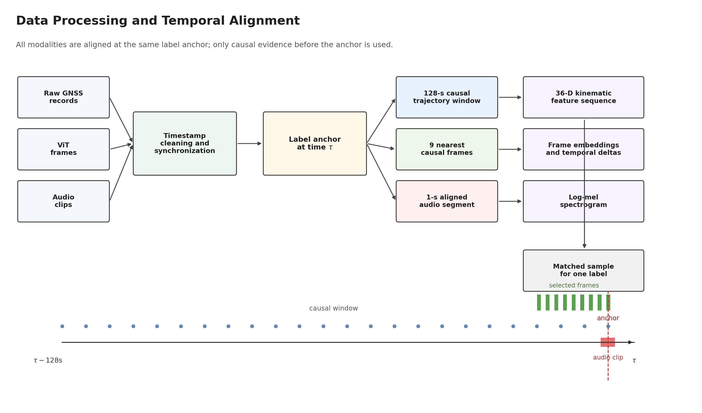
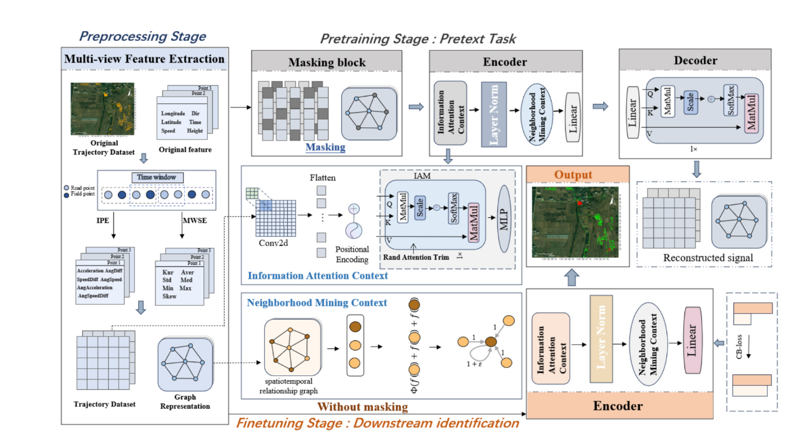
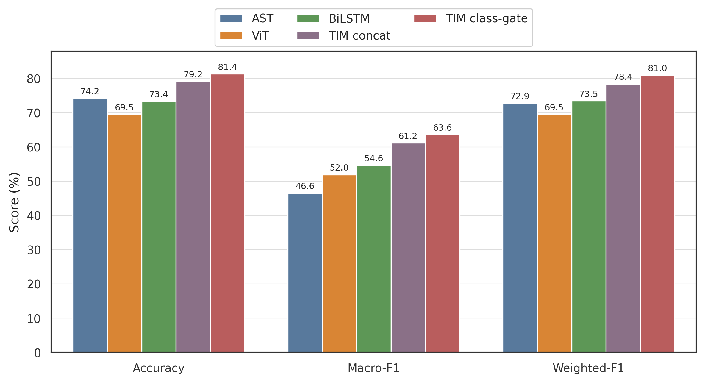

# TIM: Time-Series Classification

Reference implementation and lightweight release package for the TIM paper:

**TIM: Trajectory-ViT-Audio Multimodal Learning for Eleven-Class Agricultural Machinery Trajectory Time-Series Classification**

This branch is a curated paper-release version of the original research repo. It keeps the core training code, the paper result summaries, two lightweight trajectory checkpoints, and a tiny masked demo dataset. Large internal experiment folders, private data paths, logs, and machine-specific launcher scripts have been removed.

## Abstract

Agricultural machinery trajectory time-series classification is challenging because field operations are long-tailed, visually ambiguous, and often require coordinated temporal evidence from GNSS trajectories, video frames, and audio cues. TIM is a multimodal classification framework that aligns causal trajectory windows, sparse image observations, and short audio segments at the same supervision anchor, then fuses them with trajectory-aware multimodal modeling. The released code supports trajectory-only, image-only, audio-only, bimodal, and trimodal ablations under a unified training entrypoint. In the released paper summaries, TIM outperforms the strongest released single-modality baselines and improves over simple trimodal concatenation, reaching 81.36% accuracy and 63.64 macro-F1 on the eleven-class benchmark.

## 中文简介

TIM 是一个面向农机作业时序分类的多模态框架，统一利用 GNSS 轨迹、视频帧和音频片段进行 11 类作业状态识别。这个开源分支只保留论文复现需要的核心训练代码、轻量结果摘要、少量可公开权重，以及一个极小的 masked demo 数据集，避免把私有原始数据、超大实验目录和工作站专用脚本一起公开出去。

## Figures

### Experiment And Data Pipeline

This figure summarizes the released data alignment and causal sampling setup used by the paper code.



### Model Structure

The public release keeps the unified multimodal training entrypoint, while the trimodal paper model follows the structure below.



### Released Comparison Snapshot

The released repository also includes the final aggregate comparison figure used for the paper-scale summary.



## What is included

- `src/`: core dataset and training code for trajectory-only, image-only, audio-only, multimodal, and trimodal ablations
- `scripts/`: public-facing data preparation and figure-generation scripts
- `sample_data/masked_demo/`: tiny synthetic masked demo dataset for smoke tests and command examples
- `artifacts/paper_results/`: released paper metrics (`summary.json`, `per_class_metrics.csv`)
- `checkpoints/`: two small trajectory checkpoints that fit standard GitHub limits
- `assets/`: ready-to-use paper figures and regenerated outputs

## What is not included

- Raw field data, full aligned datasets, and private trajectory spreadsheets
- Large image/audio/trimodal checkpoints that exceed GitHub single-file limits
- Internal notes, agent configs, logs, and workstation-specific 3090/4090 scripts

## Environment

```bash
python -m venv .venv
source .venv/bin/activate
pip install -r requirements.txt
```

## Quick start

Smoke-test the dataset loader with the masked demo data:

```bash
python -m pytest tests/test_release_smoke.py
```

Run a tiny trajectory-only example on the demo data:

```bash
python src/train_ablation.py \
  --mode trajectory_only \
  --train-csv sample_data/masked_demo/train.csv \
  --val-csv sample_data/masked_demo/val.csv \
  --test-csv sample_data/masked_demo/test.csv \
  --save-dir experiments/demo_traj \
  --seq-len 4 \
  --stride 1 \
  --eval-stride 1 \
  --feature-mode raw \
  --traj-encoder lstm \
  --batch-size 2 \
  --epochs 1 \
  --num-workers 0 \
  --device cpu \
  --max-train-batches 2 \
  --max-eval-batches 1
```

Run a tiny trimodal example on the same demo data:

Note: the first trimodal run will download the AST backbone unless it is already cached locally.

```bash
python src/train_ablation.py \
  --mode trimodal \
  --train-csv sample_data/masked_demo/train.csv \
  --val-csv sample_data/masked_demo/val.csv \
  --test-csv sample_data/masked_demo/test.csv \
  --save-dir experiments/demo_trimodal \
  --seq-len 4 \
  --image-window-size 3 \
  --stride 1 \
  --eval-stride 1 \
  --feature-mode engineered \
  --traj-encoder trnet_seq \
  --traj-feature-map-size 6 \
  --batch-size 1 \
  --epochs 1 \
  --num-workers 0 \
  --device cpu \
  --no-pretrained \
  --max-train-batches 1 \
  --max-eval-batches 1
```

## Released paper results

The repository includes the final released summaries used for the paper-scale comparison:

| Model | Accuracy | Macro-F1 | Weighted-F1 |
|---|---:|---:|---:|
| AST | 74.24 | 46.57 | 72.85 |
| ViT | 69.49 | 51.96 | 69.53 |
| BiLSTM / TRNet-seq | 73.37 | 54.63 | 73.47 |
| TIM concat | 79.16 | 61.19 | 78.44 |
| TIM class-gate | 81.36 | 63.64 | 81.01 |

The raw released summaries are under [artifacts/paper_results](artifacts/paper_results).

中文说明：
- `BiLSTM / TRNet-seq` 是公开版中附带轻量 checkpoint 的轨迹基线。
- `TIM concat` 表示直接拼接式 trimodal 融合。
- `TIM class-gate` 表示论文中的类别自适应融合版本，也是当前公开结果里表现最好的模型。

## Released checkpoints

The `checkpoints/` folder intentionally contains only small trajectory checkpoints that fit normal GitHub hosting:

- `trnet_seed44_best.pt`: paper trajectory baseline
- `trajectory_only_legacy_best.pt`: earlier lightweight trajectory-only checkpoint

Image, audio, and trimodal weights are not included in this branch because their single-file sizes exceed GitHub’s standard limits.

## Dataset format

For `src/train_ablation.py`, each CSV must contain at least:

- `frame_path`
- `frame_time`
- `video_file`
- `second_in_video`
- `分类`
- `经度`
- `纬度`
- `速度`
- `深度`
- `方向角`

Audio-enabled modes additionally require:

- `audio_path`

See [docs/dataset_format.md](docs/dataset_format.md) for details.

## Public scripts

- `scripts/prepare_b_deep_part_splits.py`: filter aligned OCR/video rows with selected trajectory slices
- `scripts/build_b_deep_part_audio_dataset.py`: extract aligned 1-second WAV clips
- `scripts/build_b_deep_part_multimodal_clean_dataset.py`: build a cleaned self-contained multimodal dataset
- `scripts/analyze_behavior_durations.py`: derive adaptive sampling statistics
- `scripts/build_paper_method_figures.py`: regenerate the method figure
- `scripts/build_paper_fusion_ablation_figures.py`: regenerate paper comparison plots from released summaries

More detail: [scripts/README.md](scripts/README.md)

## Citation

If you use this repository, cite the metadata in [CITATION.cff](CITATION.cff). A ready-to-copy `BibTeX` entry is below.

```bibtex
@misc{guo2026tim,
  title        = {TIM: Trajectory-ViT-Audio Multimodal Learning for Eleven-Class Agricultural Machinery Trajectory Time-Series Classification},
  author       = {Guo, Zhou},
  year         = {2026},
  howpublished = {\url{https://github.com/kakushuu/TIM-Time-Series-Classification}},
  note         = {Code release and paper companion repository}
}
```

## License

This release is provided under the MIT License. See [LICENSE](LICENSE).
