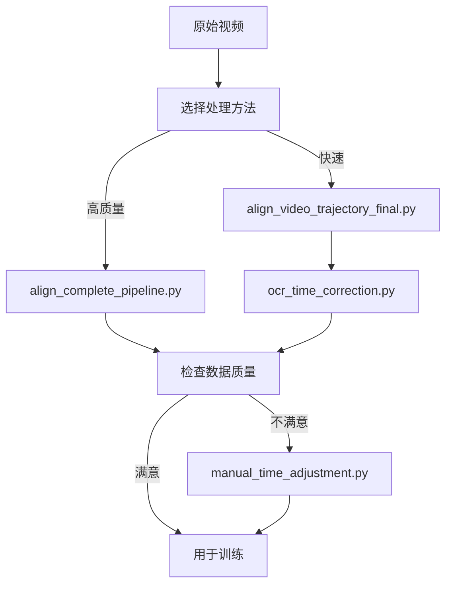
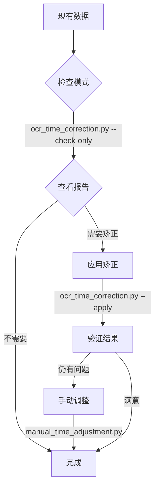

# 数据处理脚本和文档总览

## 📂 脚本文件

### 主要处理脚本

#### 1. `scripts/align_complete_pipeline.py` ⭐ **推荐**

**完整流程脚本** - 模块化设计

**流程**:
```
视频 → 提取帧 → OCR识别 → 去重 → 轨迹对齐
```

**特点**:
- ✅ 每一帧都经过 OCR 验证
- ✅ 自动去重
- ✅ 流程清晰,模块化
- ✅ 高数据质量

**使用**:
```bash
python3 scripts/align_complete_pipeline.py
```

**文档**: `docs/完整流程使用指南.md`

---

#### 2. `scripts/align_video_trajectory_final.py`

**快速对齐脚本** - 传统方法

**流程**:
```
视频 → 时间推算 → 提取帧 → 轨迹对齐
```

**特点**:
- ⚡ 速度快
- ⚡ 可能需要后期矫正
- ✅ 适合快速探索

**使用**:
```bash
python3 scripts/align_video_trajectory_final.py
```

---

#### 3. `scripts/ocr_time_correction.py`

**OCR 矫正工具** - 用于矫正现有数据

**功能**:
- 对指定时间之后的帧进行 OCR 识别
- 自动矫正时间偏差
- 生成详细报告

**使用**:
```bash
# 检查模式
python3 scripts/ocr_time_correction.py --check-only

# 应用矫正
python3 scripts/ocr_time_correction.py --apply
```

**文档**: `docs/OCR时间矫正使用指南.md`

---

#### 4. `scripts/manual_time_adjustment.py`

**手动调整工具** - 用于手动修正

**功能**:
- 交互式调整
- 配置文件批量处理
- 精确控制

**使用**:
```bash
# 交互式
python3 scripts/manual_time_adjustment.py --interactive

# 配置文件
python3 scripts/manual_time_adjustment.py --apply adjustments.json
```

**文档**: `docs/手动时间校正指南.md`

---

#### 5. `scripts/align_video_trajectory_enhanced.py`

**增强版脚本** - 支持逐帧 OCR

**特点**:
- 支持 `--frame-by-frame-ocr` 选项
- 实时 OCR 验证
- 更准确但更慢

**使用**:
```bash
python3 scripts/align_video_trajectory_enhanced.py --frame-by-frame-ocr
```

---

### 辅助脚本

- `scripts/verify_time_offset.py` - 验证时间偏移
- `scripts/test_extract_frames.py` - 测试帧提取
- `scripts/test_ocr.py` - 测试 OCR 配置

---

## 📚 文档文件

### 主要文档

#### 1. `docs/完整流程使用指南.md` ⭐ **推荐阅读**

**内容**:
- 完整的流程说明
- 每个步骤的详细解释
- 参数说明
- 使用示例

**适合**: 首次使用者

---

#### 2. `docs/数据处理流程对比.md`

**内容**:
- 新旧方法对比
- 优缺点分析
- 使用场景建议
- 迁移指南

**适合**: 选择合适方法的用户

---

#### 3. `docs/OCR时间矫正使用指南.md`

**内容**:
- OCR 矫正工具使用方法
- 参数详细说明
- 常见问题解答
- 最佳实践

**适合**: 需要矫正现有数据的用户

---

#### 4. `docs/手动时间校正指南.md`

**内容**:
- 手动调整方法
- 配置文件格式
- 使用场景
- 注意事项

**适合**: 需要精确控制的用户

---

#### 5. `docs/数据裁剪更新说明.md`

**内容**:
- 数据裁剪记录
- 更新历史
- 版本说明

---

---

## 🎯 快速选择指南

### 我是新手,应该从哪里开始?

→ 阅读 `docs/完整流程使用指南.md`
→ 运行 `python3 scripts/align_complete_pipeline.py`

### 我有现有数据,想提高质量

→ 阅读 `docs/OCR时间矫正使用指南.md`
→ 运行 `python3 scripts/ocr_time_correction.py --check-only`
→ 确认后运行 `python3 scripts/ocr_time_correction.py --apply`

### 我需要快速处理大量数据

→ 使用 `scripts/align_video_trajectory_final.py`
→ 后期用 `scripts/ocr_time_correction.py` 矫正

### 我需要最高的数据质量

→ 使用 `scripts/align_complete_pipeline.py` (新方法)
→ 或 `scripts/align_video_trajectory_enhanced.py --frame-by-frame-ocr`

### 我需要手动修正某些数据

→ 阅读 `docs/手动时间校正指南.md`
→ 使用 `scripts/manual_time_adjustment.py`

---

## 📊 当前数据状态

### 位置: `data/aligned_output/`

**文件**:
- ✓ `aligned_data.csv` - 6,272 行对齐数据
- ✓ `aligned_data.json` - JSON 格式
- ✓ `aligned_frames/` - 6,272 个帧图像
- ✓ `aligned_data_backup.csv` - 原始备份
- ✓ `ocr_correction_report.*` - OCR 矫正报告

**时间范围**:
- 开始: 2024-10-18 12:38:13
- 结束: 2024-10-18 19:34:55
- 总时长: ~6 小时 56 分钟

**数据质量**:
- ✅ 100% 帧文件匹配
- ✅ 无重复数据
- ✅ 已 OCR 验证 (18:41:34 之后)
- ✅ 适合训练使用

---

## 🔄 工作流程推荐

### 完整处理流程



### 矫正流程



---

## ⚠️ 重要提示

### 处理前

1. **备份数据**: 始终备份原始数据
2. **检查空间**: 确保有足够磁盘空间 (≥10GB)
3. **测试运行**: 先用小数据集测试

### 处理中

1. **监控进度**: 注意观察进度条
2. **记录错误**: 保存错误日志
3. **验证中间结果**: 检查每个步骤的输出

### 处理后

1. **验证数据**: 检查最终数据质量
2. **对比结果**: 与原始数据对比
3. **保存报告**: 保留处理报告

---

## 🆘 需要帮助?

### 常见问题

1. **OCR 失败率高** → 检查视频质量和光照
2. **数据不匹配** → 检查时间容差设置
3. **处理太慢** → 考虑使用快速方法
4. **时间不准** → 使用 OCR 矫正工具

### 获取支持

1. 查看相关文档
2. 检查错误日志
3. 使用测试脚本诊断

---

**最后更新**: 2026-03-05
**版本**: v2.0
**维护者**: Claude Code
